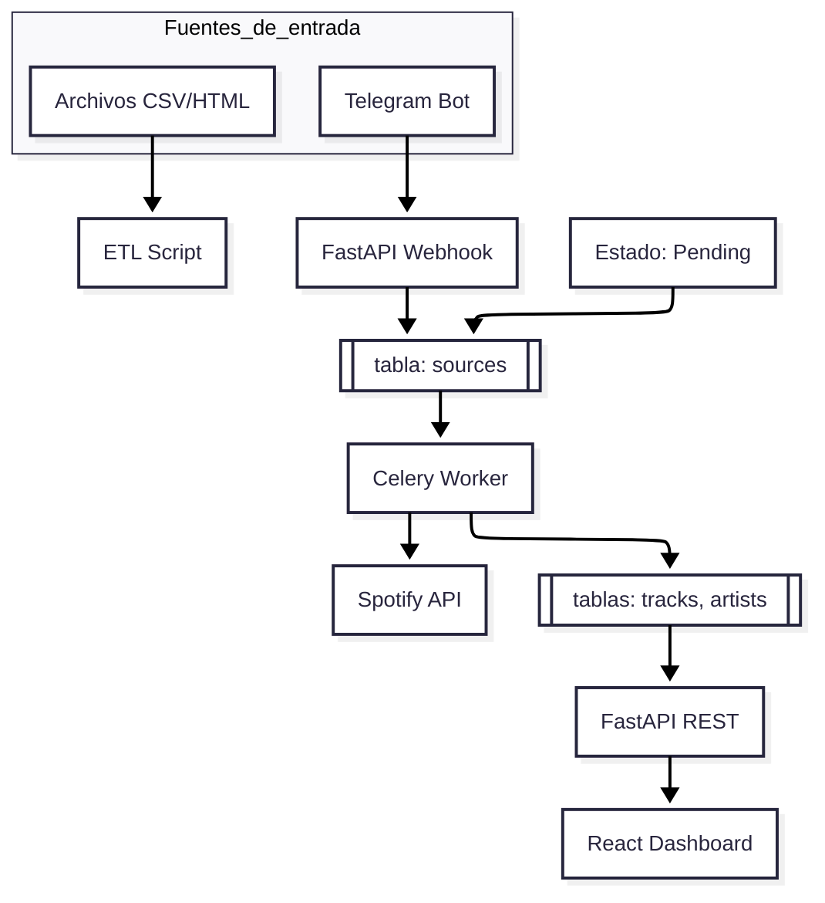

# Gestor Musical Centralizado (GMC)

> Sistema para consolidar, enriquecer y explorar el historial musical proveniente de múltiples fuentes heterogéneas.

## Motivación

El historial musical personal se fragmenta entre Shazam, marcadores del navegador y plataformas de streaming. GMC centraliza todas esas fuentes en una única base de datos, las enriquece con metadatos estructurados vía Spotify y las expone a través de una interfaz web.

## Stack Tecnológico

| Capa | Tecnología |
|---|---|
| Backend API | Python 3.10+ · FastAPI · SQLAlchemy |
| Base de datos | PostgreSQL 15 |
| Procesamiento asíncrono | Celery · Redis |
| Frontend | React · Vite · Tailwind CSS |
| Ingestión continua | Telegram Bot API |
| Enriquecimiento | Spotify Web API |
| Infraestructura local | Docker · Docker Compose |

## Arquitectura



## Inicio Rápido

### Prerrequisitos

- Docker y Docker Compose instalados
- Credenciales de Spotify Developer App (Client ID + Secret)
- Token de Telegram Bot (vía BotFather)

### Configuración

```bash
git clone https://github.com/GeraldAC/P06-GestorMusicalCentralizado.git
cd P06-GestorMusicalCentralizado
cp .env.example .env   # Completar con tus credenciales
docker compose up -d
```

### Variables de entorno requeridas

```env
# .env.example
POSTGRES_USER=
POSTGRES_PASSWORD=
POSTGRES_DB=gmc

REDIS_URL=redis://redis:6379/0

SPOTIFY_CLIENT_ID=
SPOTIFY_CLIENT_SECRET=

TELEGRAM_BOT_TOKEN=
```

### Migraciones

```bash
docker compose exec api alembic upgrade head
```

### Ingestión batch (archivos históricos)

```bash
# Shazam
docker compose exec api python -m etl.parsers.shazam --file data/shazam_export.csv

# Bookmarks del navegador
docker compose exec api python -m etl.parsers.bookmarks --file data/bookmarks.html
```

## Estructura del Proyecto

```
gmc/
├── backend/
│   ├── api/            # Routers FastAPI
│   ├── core/           # Configuración, dependencias
│   ├── etl/            # Parsers batch (CSV, HTML)
│   ├── models/         # Modelos SQLAlchemy
│   ├── schemas/        # Schemas Pydantic
│   ├── tasks/          # Tareas Celery
│   └── main.py
├── frontend/           # React + Vite
├── migrations/         # Revisiones Alembic
├── docker-compose.yml
├── .env.example
└── README.md
```

## Estado del Proyecto

| Fase | Descripción | Estado |
|---|---|---|
| 1 | Infraestructura y modelado | ▣ Pendiente |
| 2 | ETL histórico y API base | ▣ Pendiente |
| 3 | Spotify + Celery | ▣ Pendiente |
| 4 | Telegram Bot | ▣ Pendiente |
| 5 | Frontend Dashboard | ▣ Pendiente |

## Licencia

MIT