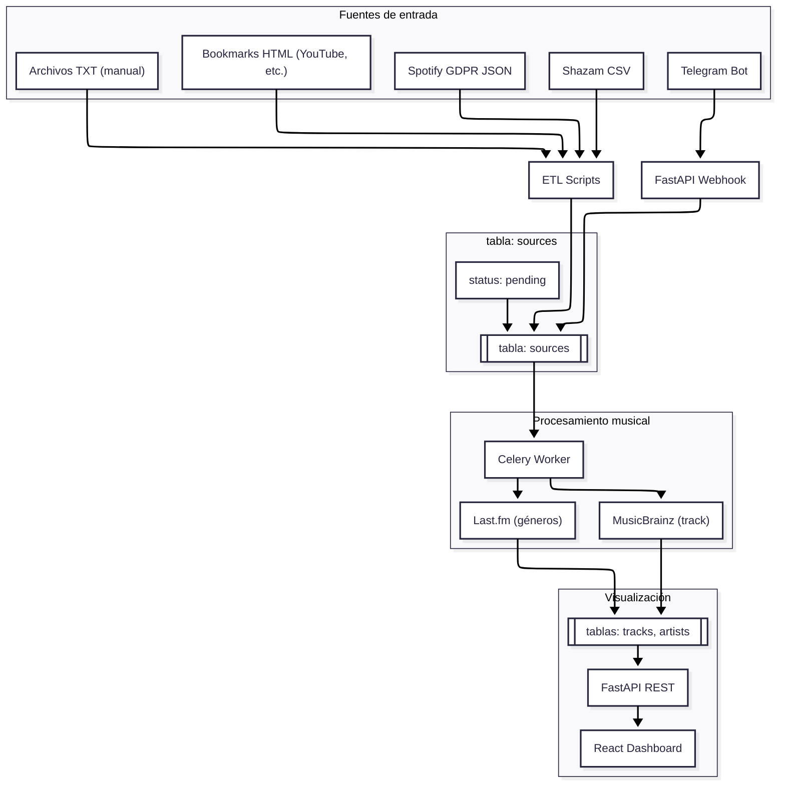

# Gestor Musical Centralizado (GMC)

> Sistema para consolidar, enriquecer y explorar el historial musical proveniente de múltiples fuentes heterogéneas.

## Motivación

El historial musical personal se fragmenta entre Shazam, marcadores del navegador, exportaciones de Spotify y archivos de texto con registros manuales. GMC centraliza todas esas fuentes en una única base de datos, las enriquece con metadatos estructurados vía MusicBrainz y Last.fm, y las expone a través de una interfaz web.

## Stack Tecnológico

| Capa | Tecnología |
|---|---|
| Backend API | Python 3.10+ · FastAPI · SQLAlchemy |
| Base de datos | PostgreSQL 15 |
| Procesamiento asíncrono | Celery · Redis |
| Frontend | React · Vite · Tailwind CSS |
| Ingestión continua | Telegram Bot API |
| Enriquecimiento (principal) | MusicBrainz API · `musicbrainzngs` |
| Enriquecimiento (géneros) | Last.fm API |
| Infraestructura local | Docker · Docker Compose |

## Arquitectura



## Inicio Rápido

### Prerrequisitos

- Docker y Docker Compose instalados
- API key de Last.fm (gratuita — registro en last.fm/api)
- Token de Telegram Bot (vía BotFather)
- MusicBrainz no requiere autenticación para uso básico; el worker respeta el rate limit de 1 req/s

### Configuración

```bash
git clone https://github.com/GeraldAC/P06-GestorMusicalCentralizado.git
cd gmc
cp .env.example .env   # Completar con tus credenciales
docker compose up -d
```

### Variables de entorno requeridas

```env
# .env.example
POSTGRES_USER=
POSTGRES_PASSWORD=
POSTGRES_DB=gmc

REDIS_URL=redis://redis:6379/0

LASTFM_API_KEY=

TELEGRAM_BOT_TOKEN=

# Identificador del agente para MusicBrainz (obligatorio por su política)
# Formato sugerido: gmc/0.1.0 ( contacto@email.com )
MUSICBRAINZ_USER_AGENT=
```

### Migraciones

```bash
docker compose exec api alembic upgrade head
```

### Ingestión batch (archivos históricos)

```bash
# Bookmarks del navegador (HTML exportado)
docker compose exec api python -m etl.parsers.bookmarks --file data/bookmarks.html

# Shazam
docker compose exec api python -m etl.parsers.shazam --file data/shazam_export.csv

# Exportación GDPR de Spotify (JSON)
docker compose exec api python -m etl.parsers.spotify_gdpr --file data/StreamingHistory_music_0.json

# Archivos TXT con entradas manuales
docker compose exec api python -m etl.parsers.txt_manual --file data/canciones.txt
```

## Estructura del Proyecto

```
P06-GestorMusicalCentralizado/
├── backend/
│   ├── api/            # Routers FastAPI
│   ├── core/           # Configuración, dependencias
│   ├── etl/            # Parsers batch (HTML, CSV, JSON, TXT)
│   │   └── parsers/
│   │       ├── bookmarks.py
│   │       ├── shazam.py
│   │       ├── spotify_gdpr.py
│   │       └── txt_manual.py
│   ├── models/         # Modelos SQLAlchemy
│   ├── schemas/        # Schemas Pydantic
│   ├── tasks/          # Tareas Celery
│   └── main.py
├── frontend/           # React + Vite
├── migrations/         # Revisiones Alembic
├── docker-compose.yml
├── .env.example
└── README.md
```

## Obtención de datos históricos

| Fuente | Mecanismo de exportación |
|---|---|
| YouTube (bookmarks) | Exportar marcadores del navegador como HTML |
| Shazam | App → Perfil → Exportar historial (CSV) |
| Spotify favorites | [Exportify](https://exportify.app) → CSV limpio vía OAuth oficial |
| TXT manual | Archivos propios con líneas `Artista - Título` |

> **Nota sobre Spotify:** La exportación GDPR oficial (solicitada desde la cuenta) es la fuente preferida cuando esté disponible. Exportify es la alternativa inmediata y legítima mientras llega.

## Estado del Proyecto

| Fase | Descripción | Estado |
|---|---|---|
| 1 | Infraestructura y modelado | ▣ Pendiente |
| 2 | ETL histórico y API base | ▣ Pendiente |
| 3 | MusicBrainz + Last.fm + Celery | ▣ Pendiente |
| 4 | Telegram Bot | ▣ Pendiente |
| 5 | Frontend Dashboard | ▣ Pendiente |

## Licencia

MIT
